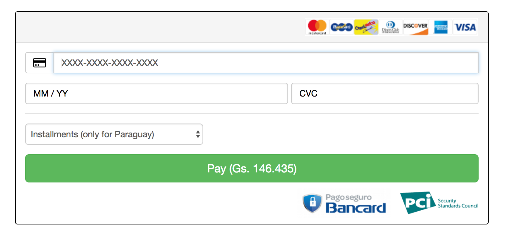

# bancard-checkout-js
Biblioteca de referencia desarrollada por [Bancard](http://www.bancard.com.py/) que permite ingresar la información de una tarjeta para realizar un pago (`single_buy` de vPOS) en un e-commerce sin salir del mismo. La información sensible de la tarjeta es ingresada siempre en Bancard, embebido con el look and feel del comercio sin ninguna redirección.

**Precondición**

_Como precondición para utilizar esta biblioteca y poder integrar el servicio de vPOS, el comercio debe estar registrado y habilitado por Bancard contando con acceso al [Portal de comercios](https://comercios.bancard.com.py) así como acceso al servicio de [vPOS](http://www.bancard.com.py/index.php/vpos/)._

**Pasos para realizar la integración:**

0. Generar un process_id
1. Incluir `bancard-checkout.js`
2. Inicializar contenedor con código JavaScript

## 0. Generar un process_id
Como primer paso se debe seguir invocando al servicio de `single_buy` con los parámetros habituales. Por más detalles, consultar documentación en el [Portal de comercios](https://comercios.bancard.com.py). El servicio de vPOS retornará un process_id válido para realizar la integración con esta biblioteca.

## 1. Incluir bancard-checkout.js
Para utilizar la biblioteca _bancard-checkout.js_ se debe incluir la misma utilizando, por ejemplo, el siguiente código:

```javascript
<script src="bancard-checkout.js"></script>
```

## 2. Inicializar contenedor con código JavaScript
Para montar el formulario de pago en el sitio web, se debe ejecutar `Bancard.Checkout.createForm` indicando el id del contenedor, process_id y un conjunto de opciones que incluyen los estilos asociados al elemento embebido.

El [PROCESS_ID] es el hash resultante de haber invocado a la operación `single_buy` de la API de vPOS.

**Ejemplo de invocación**

```javascript
   window.onload = function() {
      Bancard.Checkout.createForm('iframe-container', '[PROCESS_ID]', options);
   };
```

### Modificar estilos
Puede modificarse la información de estilos del contenedor con atributros ya definidos. La lista completa es:

```
  - name: input-background-color
    text: Color fondo de campos
    type: color
    default: '#FFFFFF'
  - name: input-text-color
    text: Color texto de campos
    type: color
    default: '#555555'
  - name: input-border-color
    text: Color borde de campos
    type: color
    default: '#CCCCCC'
  - name: button-background-color
    text: Color fondo del botón
    type: color
    default: '#5CB85C'
  - name: button-text-color
    text: Color texto del botón
    type: color
    default: '#FFFFFF'
  - name: button-border-color
    text: Color borde del botón
    type: color
    default: '#4CAE4C'
  - name: form-background-color
    text: Color fondo de formulario
    type: color
    default: '#FFFFFF'
  - name: form-border-color
    text: Color del borde del formulario
    type: color
    default: '#DDDDDD'
  - name: header-background-color
    text: Color fondo de encabezado
    type: color
    default: '#F5F5F5'
  - name: header-text-color
    text: Color texto de encabezado
    type: color
    default: '#333333'
  - name: hr-border-color
    text: Color de linea separadora
    type: color
    default: '#EEEEEE'
  - name: header-show
    text: Mostrar encabezado
    type: boolean
    default: true
  - name: watermark-show
    text: Mostrar marca de agua
    type: boolean
    default: true
```

Ejemplo:

```javascript
      var styles = {
        'input-background-color' : '#453454',
        'input-text-color': '#B22222',
        'input-border-color' : '#CCCCCC',
        'input-placeholder-color' : '#999999',
        'button-background-color' : '#5CB85C',
        'button-text-color' : '#FFFFFF',
        'button-border-color' : '#4CAE4C',
        'form-background-color' : '#AB97CC',
        'form-border-color' : '#DDDDDD',
        'header-background-color' : '#F5F5F5',
        'header-text-color' : '#333333',
        'hr-border-color' : '#B22222',
        'header-show' : false,
        'watermark-show' : false
      };

      options = {
        styles: styles
      }
```

### Ejemplo completo del código HTML y JavaScript

```javascript
<html>
  <head>
    <script src="bancard-checkout-1.0.0.js"></script>
  </head>

  <script type="text/javascript">
    window.onload = function () {

      var styles = {
        'input-background-color' : '#453454',
        'input-text-color': '#B22222',
        'input-border-color' : '#CCCCCC',
        'input-placeholder-color' : '#999999',
        'button-background-color' : '#5CB85C',
        'button-text-color' : '#FFFFFF',
        'button-border-color' : '#4CAE4C',
        'form-background-color' : '#999999',
        'form-border-color' : '#DDDDDD',
        'header-background-color' : '#F5F5F5',
        'header-text-color' : '#333333',
        'hr-border-color' : '#B22222',
        'header-show' : false,
        'watermark-show' : false
      };

      options = {
        styles: styles
      }

      Bancard.Checkout.createForm('iframe-container', '[PROCESS_ID]', options);
    };
  </script>

  <body>

    <h1>iFrame vPos</h1>

    <div style="height: 130px; width: 100%; margin: auto" id="iframe-container"/>

  </body>
</html>
```




## Acceder al código fuente y builds de la biblioteca
Puedes ver el código fuente de la biblioteca y aportar con comentarios, pull requests o directamente ver como está implementada.
Para acceder a este proyecto puedes ir directamente a [bancard-connectors](https://github.com/Bancard/bancard-connectors/tree/develop/vpos/checkout/javascript)

Si quieres acceder a los builds de esta biblioteca puedes hacerlo desde la [carpeta de builds](https://github.com/Bancard/bancard-checkout-js/tree/master/build)

Ej. [bancard-checkout-1.0.0.js](build/bancard-checkout-1.0.0.js)

